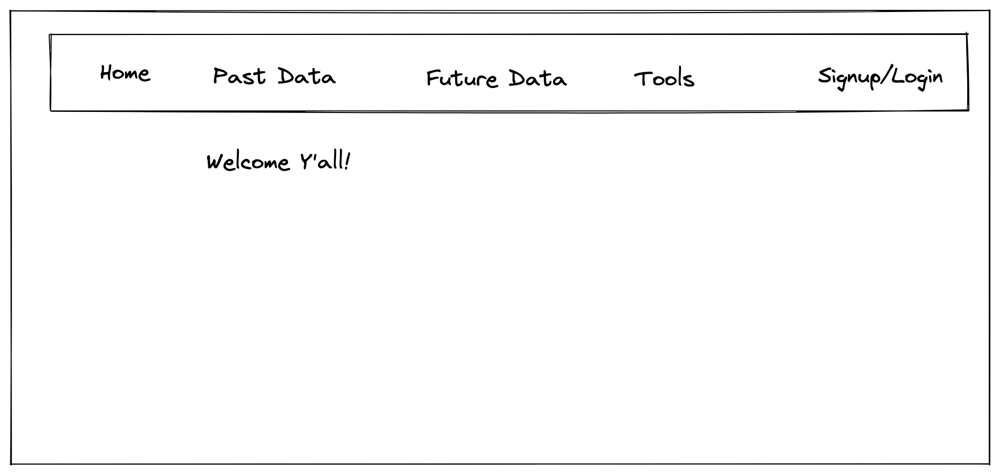
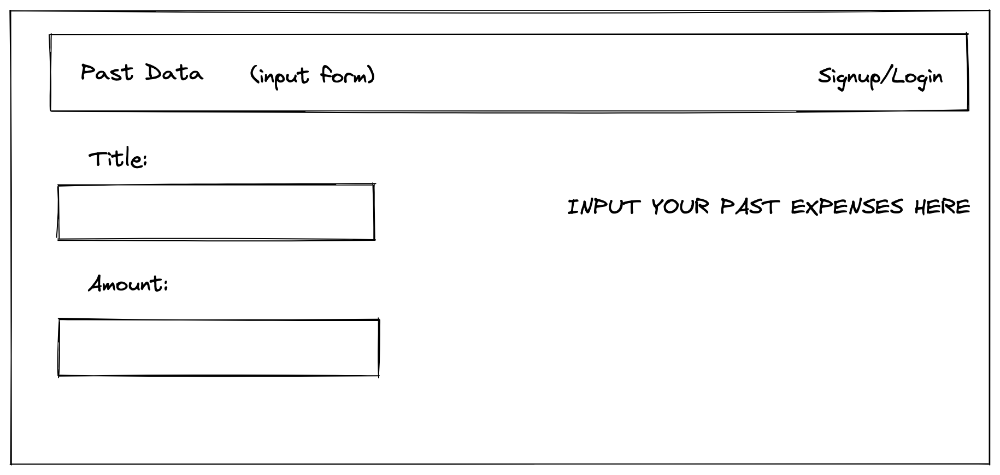
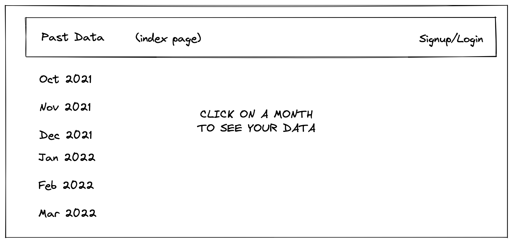
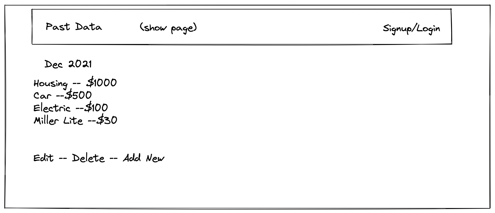

# Finance on Rails
## By Ted Tash as part of General Assembly's Software Engineering Bootcamp

### Description:
**The purpose of this app is to:**
- Store/track historical financial data
- Help budget/plan for the financial future

My vision for this site is to allow user's to input their past monthly spending in itemized fashion (i.e.their bills) as well as their incomes in a monthly itemized fashion. I hope that by seeing their historical data over time, it will allow them to plan for their future and to reach financial independence. In regards to planning, the site will also feature a "future" section, allowing the user to input their *planned* expepenses and *planned* income for upcoming month(s) which should allow them to keep track of their money and identify potential money suckers/unnecessary expenses. I have personally found that writing a monthly budget really helps to control your money. Dave Ramsey says "you can control your money, or you can watch it control you". My goal with this site is to enable people to regain control over their finances by having an easy way to track past financial data and plan for the future.

### Deployed at:
https://quiet-retreat-79809.herokuapp.com/

### User Stories:
- As a user, I would have a welcome page to greet me and prompt me to poke around or sign up
- As a user interested in actually using the site, I would be prompted to sign up
- As a signed up user, I would need input forms to enter my past expenses
- As a signed up user, I would need input forms to enter my past incomes
- As a signed up user, I would need a tab to be able to view my previously entered expense/income data by month
- As a user, I would then be done with the past data section of the site
- As a user, I would NOT want to view anyone else's data, and would NOT want them to be able to view my data
- As a user, I would want to plan ahead so I would visit the future section of the site
- As a user, I would enter in my planned expenses/incomes
- As a user, I would want to be able to check my planned data against my past data to see if the numbers line up
- As a user, I would want some helpful links to check out other financial resources

### Wireframes: 

### MVP Goals:
**My MVP Goals for this site would be:**
- User Auth 
- Full CRUD function
- Deployment to the web

### Stretch Goals:
**My Stretch Goals for this site would be:**
- Really good styling (I have not done very well on styling, and want this to be good)
- Would like to add other helpful features such as a mortgage calculator and a compound interest calculator
- Would like to figure out how to display the past/future data can be displayed together for side by side comparison
- Would like a "goals" tracker section to allow user's to track their progress on financial goals (buying a home, car, retirement)

### Technologies used:
Ruby and Ruby on Rails were the technologies used in this project. The backend and frontend were all built in a single rails app and deployed via Heroku.

### Acknowledgments:
I would like to acknowledge the following people for their help in the creation of this project:
- My wife, Lydia, without whose support I would never have made it this far
- My instructors, Holly and Brian (don't forget about Max) who taught me so much in the last 12 weeks
- My friend, Will, who encouraged me to go down the path of software engineering
- Myself for actually building the darn thing

